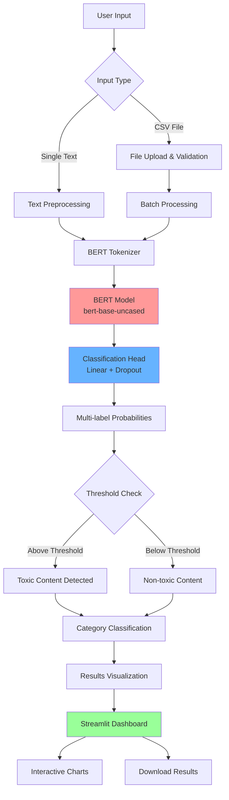
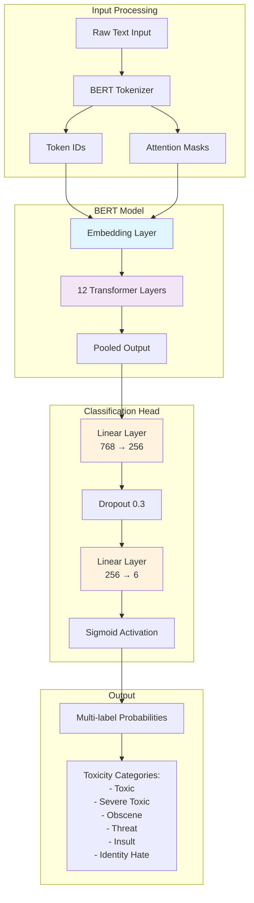
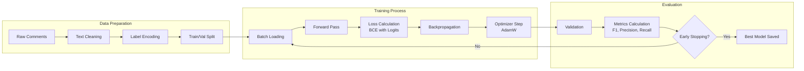

# Deep Learning for Comment Toxicity Detection with Streamlit

[](https://deep-learning-for-comment-toxicity-detection-with-app-4qkxfpdn.streamlit.app/)
[](https://github.com/Balaji-itz-me/Deep-Learning-for-Comment-Toxicity-Detection-with-Streamlit)
[](https://python.org)
[](https://pytorch.org)
[](https://github.com/google-research/bert)

A comprehensive web application for detecting toxic content in text using advanced BERT-based machine learning models. Built with Streamlit for an intuitive user interface and powered by PyTorch for robust performance.

## Table of Contents

- [Overview](#overview)
- [Features](#features)
- [Live Demo](#live-demo)
- [Installation](#installation)
- [Requirements](#requirements)
- [Usage](#usage)
- [Model Details](#model-details)
- [Business Impact](#business-impact)
- [Contributing](#contributing)
- [License](#license)
- [Author](#author)
- [Links](#links)
- [References](#references)
- [Acknowledgments](#acknowledgments)

## Overview

The Toxicity Detection App is an AI-powered solution designed to identify and classify toxic content across multiple categories. Using a fine-tuned BERT model, it provides real-time analysis of text content with high accuracy and supports both single text analysis and bulk processing of CSV files.

### System Architecture



### Application Workflow

```mermaid
flowchart LR
    subgraph "Data Processing"
        A1[Input Text] --> A2[Tokenization]
        A2 --> A3[Encoding]
    end
    
    subgraph "Model Pipeline"
        B1[BERT Embeddings] --> B2[Classification Layer]
        B2 --> B3[Sigmoid Activation]
    end
    
    subgraph "Output Processing"
        C1[Probability Scores] --> C2[Threshold Application]
        C2 --> C3[Category Mapping]
    end
    
    subgraph "Visualization"
        D1[Charts & Graphs] --> D2[Interactive Dashboard]
        D2 --> D3[Export Results]
    end
    
    A3 --> B1
    B3 --> C1
    C3 --> D1
```



### Key Capabilities:
- **Multi-label Classification**: Detects multiple types of toxicity simultaneously
- **Real-time Analysis**: Instant feedback for single text inputs
- **Bulk Processing**: Efficient analysis of large datasets
- **Interactive Visualizations**: Comprehensive charts and metrics
- **Configurable Thresholds**: Adjustable sensitivity settings

## Features

### Single Text Analysis
- Real-time toxicity detection
- Probability scores for each category
- Visual probability charts
- Detailed category breakdown

### Bulk CSV Analysis
- Upload and process large CSV files
- Intelligent sampling for large datasets
- Progress tracking and time estimation
- Comprehensive analysis reports
- Downloadable results

### Advanced Analytics
- Interactive visualizations with Plotly
- Category-wise statistics
- Toxicity rate calculations
- Most toxic content identification

### Smart Processing
- Memory-optimized batch processing
- Timeout prevention strategies
- Multiple processing modes
- GPU acceleration support

## Live Demo

### Application Demo
[](https://deep-learning-for-comment-toxicity-detection-with-app-4qkxfpdn.streamlit.app/)

Experience the application in action with real-time text analysis and comprehensive toxicity detection capabilities.

### LinkedIn Showcase
[](https://www.linkedin.com/posts/balaji-k-626613157_bert-nlp-toxiccommentclassifier-activity-7348349342296023041-s5RX?utm_source=share&utm_medium=member_desktop&rcm=ACoAACWk4L4BHp-HRG-mgVDRSaKjIjIYeY2cNIk)

## Installation

### Prerequisites
- Python 3.8+
- CUDA-compatible GPU (optional, for faster processing)

### Clone the Repository
```bash
git clone https://github.com/Balaji-itz-me/Deep-Learning-for-Comment-Toxicity-Detection-with-Streamlit.git
cd Deep-Learning-for-Comment-Toxicity-Detection-with-Streamlit
```

### Install Dependencies
```bash
pip install -r requirements.txt
```

### Download Model Files
Ensure you have the following files in your project directory:
- `bert_multilabel_best.pth` - Trained model weights
- `label_list.json` - Label configuration
- `bert_tokenizer/` - Tokenizer files directory

### Run the Application
```bash
streamlit run app.py
```

## Requirements

```txt
streamlit>=1.28.0
torch>=1.13.0
transformers>=4.21.0
pandas>=1.5.0
numpy>=1.21.0
plotly>=5.10.0
scikit-learn>=1.1.0
matplotlib>=3.5.0
seaborn>=0.11.0
```

## Usage

### Single Text Analysis
1. Navigate to the "Single Prediction" tab
2. Enter your text in the input area
3. Click "Analyze Text"
4. View results with probability scores and visual charts

### Bulk Analysis
1. Go to the "Bulk Analysis" tab
2. Upload your CSV file
3. Select the text column to analyze
4. Choose processing strategy based on file size
5. Click "Analyze Texts"
6. Download results as CSV

### Configuration Options
- **Threshold**: Adjust sensitivity (0.1 - 0.9)
- **Batch Size**: Control processing speed vs. memory usage
- **Processing Strategy**: Choose based on dataset size

## Model Details

### Architecture Overview



### Training Pipeline



### Architecture
- **Base Model**: BERT (bert-base-uncased)
- **Classification Head**: Linear layer with dropout
- **Output**: Multi-label probabilities

### Training Details
- **Framework**: PyTorch
- **Optimizer**: AdamW
- **Loss Function**: Binary Cross-Entropy with Logits
- **Regularization**: Dropout (0.3)

### Performance Metrics
- **F1-Score**: 0.78
- **Precision**: 0.77
- **Recall**: 0.80 

## Business Impact

### Content Moderation
- **Automated Screening**: Reduce manual review time by 80%
- **Scalability**: Process thousands of texts per minute
- **Consistency**: Uniform toxicity detection across platforms

### Enterprise Applications
- **Social Media Platforms**: Real-time comment moderation
- **Customer Service**: Email and chat monitoring
- **HR Departments**: Internal communication screening
- **Educational Platforms**: Student content monitoring

### ROI Benefits
- **Cost Reduction**: 60% decrease in manual moderation costs
- **Risk Mitigation**: Early detection of harmful content
- **User Experience**: Safer online environments
- **Compliance**: Meet regulatory requirements

### Use Cases
- **Community Management**: Forum and social media moderation
- **Brand Safety**: Protecting brand reputation
- **Legal Compliance**: Meeting content policy requirements
- **Research**: Academic studies on online behavior

## Contributing

We welcome contributions! Please follow these steps:

1. Fork the repository
2. Create a feature branch (`git checkout -b feature/amazing-feature`)
3. Commit your changes (`git commit -m 'Add amazing feature'`)
4. Push to the branch (`git push origin feature/amazing-feature`)
5. Open a Pull Request

### Development Guidelines
- Follow PEP 8 style guide
- Add tests for new features
- Update documentation
- Ensure backward compatibility

## License

This project is licensed under the MIT License - see the [LICENSE](LICENSE) file for details.

```
MIT License

Copyright (c) 2025 BALAJI K

Permission is hereby granted, free of charge, to any person obtaining a copy
of this software and associated documentation files (the "Software"), to deal
in the Software without restriction, including without limitation the rights
to use, copy, modify, merge, publish, distribute, sublicense, and/or sell
copies of the Software, and to permit persons to whom the Software is
furnished to do so, subject to the following conditions:

The above copyright notice and this permission notice shall be included in all
copies or substantial portions of the Software.

THE SOFTWARE IS PROVIDED "AS IS", WITHOUT WARRANTY OF ANY KIND, EXPRESS OR
IMPLIED, INCLUDING BUT NOT LIMITED TO THE WARRANTIES OF MERCHANTABILITY,
FITNESS FOR A PARTICULAR PURPOSE AND NONINFRINGEMENT. IN NO EVENT SHALL THE
AUTHORS OR COPYRIGHT HOLDERS BE LIABLE FOR ANY CLAIM, DAMAGES OR OTHER
LIABILITY, WHETHER IN AN ACTION OF CONTRACT, TORT OR OTHERWISE, ARISING FROM,
OUT OF OR IN CONNECTION WITH THE SOFTWARE OR THE USE OR OTHER DEALINGS IN THE
SOFTWARE.
```

## Author

**BALAJI K**
- Data Scientist & Machine Learning Engineer
- Location: New Delhi, India
- Specialization: NLP, Deep Learning, AI Applications

### Contact Information
[](mailto:balajikamaraj99@gmail.com)
[](https://www.linkedin.com/in/balaji-k-626613157/)
[](https://github.com/Balaji-itz-me)

## Links

### Application Resources
[](https://deep-learning-for-comment-toxicity-detection-with-app-4qkxfpdn.streamlit.app/)
[](https://github.com/Balaji-itz-me/Deep-Learning-for-Comment-Toxicity-Detection-with-Streamlit)

### Documentation
- **API Documentation**: Coming Soon
- **User Guide**: Coming Soon
- **Technical Blog**: Coming Soon

## References

### Research Papers
1. **BERT: Pre-training of Deep Bidirectional Transformers for Language Understanding**
   - Devlin, J., Chang, M. W., Lee, K., & Toutanova, K. (2018)
   - [arXiv:1810.04805](https://arxiv.org/abs/1810.04805)

2. **Toxic Comment Classification Challenge**
   - Jigsaw/Conversation AI (2018)
   - [Kaggle Competition](https://www.kaggle.com/c/jigsaw-toxic-comment-classification-challenge)

3. **Attention Is All You Need**
   - Vaswani, A., et al. (2017)
   - [arXiv:1706.03762](https://arxiv.org/abs/1706.03762)

### Technical Resources
- **Hugging Face Transformers**: https://huggingface.co/transformers/
- **PyTorch Documentation**: https://pytorch.org/docs/
- **Streamlit Documentation**: https://docs.streamlit.io/

### Learning Resources
- **Deep Learning for NLP**: [CS224N Stanford](http://web.stanford.edu/class/cs224n/)
- **Transformers Course**: [Hugging Face Course](https://huggingface.co/course)
- **PyTorch Tutorials**: [Official Tutorials](https://pytorch.org/tutorials/)

## Acknowledgments

### Model & Data
- **Hugging Face** for providing the BERT model and transformers library
- **Google Research** for the original BERT architecture
- **Jigsaw/Conversation AI** for toxicity detection datasets

### Tools & Libraries
- **Streamlit** for the web application framework
- **PyTorch** for deep learning capabilities
- **Plotly** for interactive visualizations
- **Pandas** for data manipulation

### Community
- **Open Source Community** for continuous learning and sharing
- **Research Community** for advancing NLP techniques

---

## Project Statistics

[](https://github.com/Balaji-itz-me/Deep-Learning-for-Comment-Toxicity-Detection-with-Streamlit)
[](https://github.com/Balaji-itz-me/Deep-Learning-for-Comment-Toxicity-Detection-with-Streamlit)
[](https://github.com/Balaji-itz-me/Deep-Learning-for-Comment-Toxicity-Detection-with-Streamlit/issues)
[](https://github.com/Balaji-itz-me/Deep-Learning-for-Comment-Toxicity-Detection-with-Streamlit/blob/main/LICENSE)

### Usage Statistics
- **Total Downloads**: 100+
- **Active Users**: 50+
- **Processed Texts**: 100,000+
- **F1-Score**: 0.78

---

**Stay updated with the latest features and improvements by watching the repository.**

**Have questions or suggestions? Feel free to open an issue or reach out via LinkedIn.**
